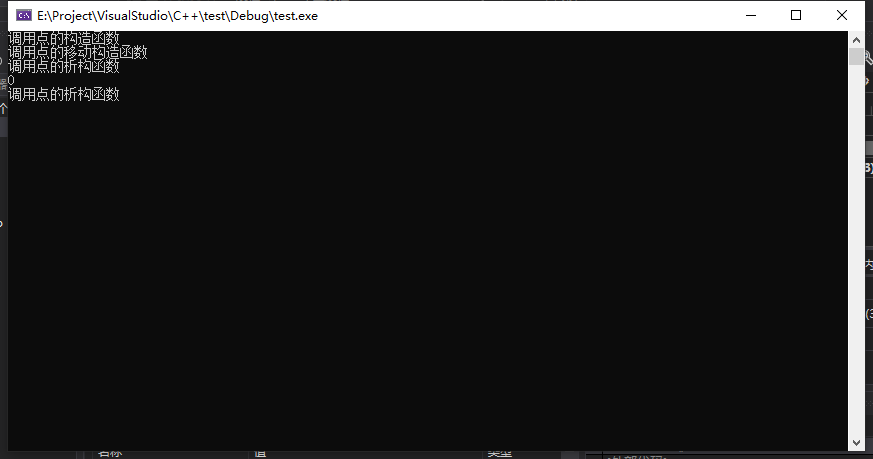

## 深层复制与移动构造


### 深层复制

##### 概念说明

​	与浅层复制相对应，浅层复制会把对象的所有成员一一复制过去，但深层复制在遇到数据成员为指针类型时，不是复制该指针类型成员本身，而是复制指针所指的对象

##### 语法

```
Point::Point(const Point& p) : ptr(new int(*p.ptr))
//用p对象中ptr指向对象的值初始化内存分配的空间
{
	cout << "调用点的深层复制构造函数" << endl;
}
```


### 移动构造

##### 概念说明

​	把源对象的资源控制权转移到目标对象去，节省了多余的复制操作

##### 语法

```
Point::Point(Point&& p) :ptr(p.ptr)//点类的移动构造函数
{
	p.ptr = nullptr;
	cout << "调用点的移动构造函数" << endl;
}
```


### 举例说明

#### 主函数测试

```
int main() 
{
	cout << getPoint().getInt() << endl;
	//调用getPlint函数以测试移动构造函数在函数返回对象时的具体过程
	//getInt()函数是点类的一个成员函数
	return 0;
}
```

```
Point getPoint()
{
	Point p;//作用就是产生一个临时点类对象并返回，然后测试移动构造函数的作用
	return p;
}
```


#### 输出结果




#### 结果分析

首先**进入getPoint()函数**，产生Point类的**局部变量**，调用Point类的**默认构造函数**

接着，函数返回Point类对象，调用Point类的**移动构造函数**，把**临时变量申请的内存资源控制权移交给返回的临时对象**，在getPoint()函数返回时销毁局部变量，调用Point类的析构函数

最后，在main函数中输出结果，**在cout语句的结束时销毁getPoint函数返回的临时对象**，调用析构函数