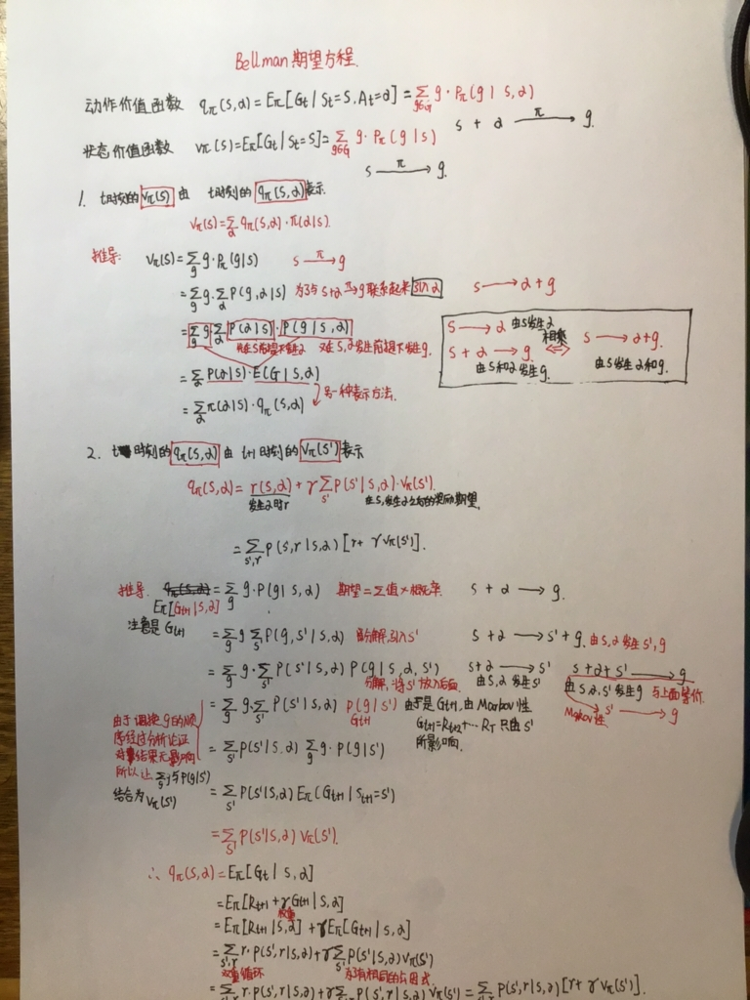

### Bellman期望方程与算法基础课

#### Bellman期望方程

##### 收获

1. 主要学习了**状态价值函数 v(s) **和 **动作状态函数q(s, α)** 的互相表示的推导证明
2. 明白了**要严谨严谨再严谨**，今天的推导过程，把Gt+1看成了Gt，导致对某一重要过程产生了误解
3. 分析了**概率中多重循环下的顺序问题**，判断是否可以调换顺序
4. 这两个推导过程是求解期望方程的重要步骤

#### 算法基础课

1. 学完了stl库和常用的位运算
2. 学完了所有算法基础课的内容
3. 明天把剩下的10道题刷完

#### 总结

​	今天主要在学**Bellman期望方程的推导**和把算法基础课看完

#### 明天规划

​	明天把Bellman期望方程的原理及实现完全搞定

​	做完最后的算法基础课题