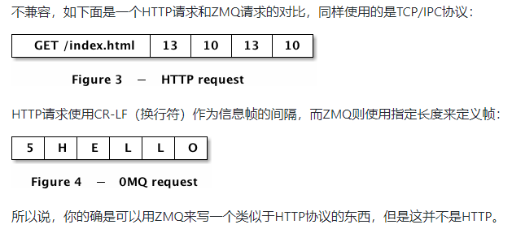

### zmq进阶篇学习一


##### 字符串

​	C语言的字符串以空字符结尾，所以发送的字节数要 +1


##### 获取版本号

```
zmq_version (&major, &minor, &patch);//主版本号，次版本号，补丁号
```


socket是一个指针类型，context是一个数据结构


zmq套接字由zmq管理，context由程序员管理


zmq是异步的，伸缩性强


##### socket与网络拓扑

1. server可以只使用一个socket就能bind多个端口号，协议可以不同
2. client也可以使用一个socket同时建立多个连接
3. server是稳定的，client是灵活的


##### socket与传送数据

​	使用zmq_sned()和zmq_recv()函数

1. zmq socket传输的是消息message
2. zmq socket在后台进行I/O操作，发/收消息只是把数据送到本地的缓冲队列，队列大小可配置
3. 即使zmq_send()有返回值，也不能代表消息已经发送


##### zmq与网络协议

1. zmq不只是一个数据传输工具，而是现有协议上建立的**新框架**

2. zmq的数据帧与现有的协议并不兼容

3. 可以自行设计一种通信协议，用zmq进行连接

   




##### I/O线程

​	一个I/O线程可以处理多个socket的传输要求，一个socket可以处理多个连接


##### 核心消息模式

​	主要有：请求-应答、发布-订阅、管道、排他对接

​	合法的socket connect-bind对：

- PUB-SUB
- REQ - REP
- REQ - ROUTER
- DEALER - REP
- DEALER - ROUTER
- DEALER - DEALER
- ROUTER - ROUTER
- PUSH - PULL
- PAIR - PAIR


##### context的使用方法

1. zmq传输单位是context，即一个二进制块
2. 可以使用序列化工具Protocal Buffers、XDR、JSON等，把内容转化为zmq context
3. 将一个context对象传递给zmq_send()后，对象长度就会被清零

​	

