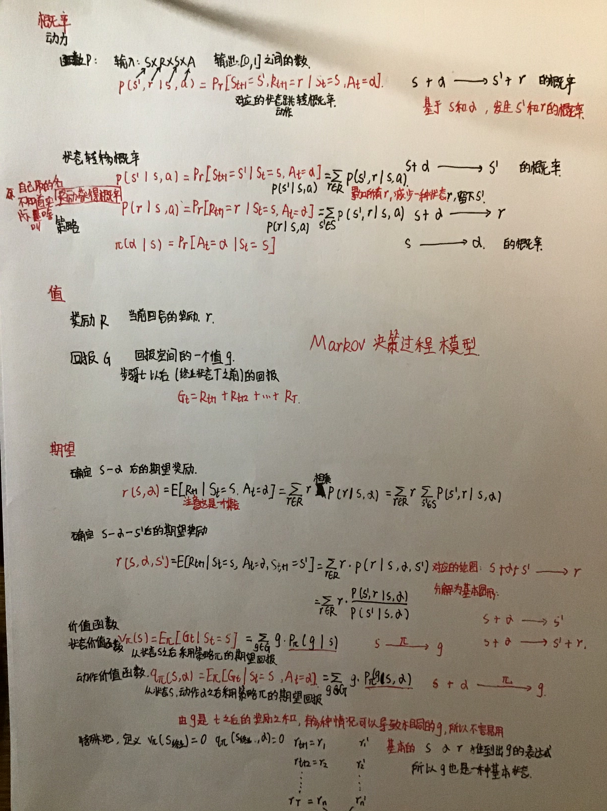

### Markov决策过程模型分析与算法基础课

#### Markov数学模型分析

##### 主要收获

1. 对决策过程涉及的概念的数学描述有了深刻的理解
2. 由于书本的符号系统比较繁杂，所以根据自己的想法改进一下，初步形成**自己的符号系统**
3. 对书中的概念做一个抽象的汇总，并**推陈出新一个新的概念**，目前还不知道是否被定义过
4. 对**表达式的推导过程做了一个详细分析**，在数学原理层面上有了深刻理解

#### 算法基础课

1. 稍微练习了一下字符串的一些操作，确实和数组有着较大的差异
2. 在**链表翻转**问题上，使用**双指针算法**，有了很好的时间复杂度
3. 写**两个链表的第一个公共结点**问题时，新学了一种非常巧妙的方法。其来源主要是**观察出抽象模型的数学规律**，进而用很简单的方法解决问题。